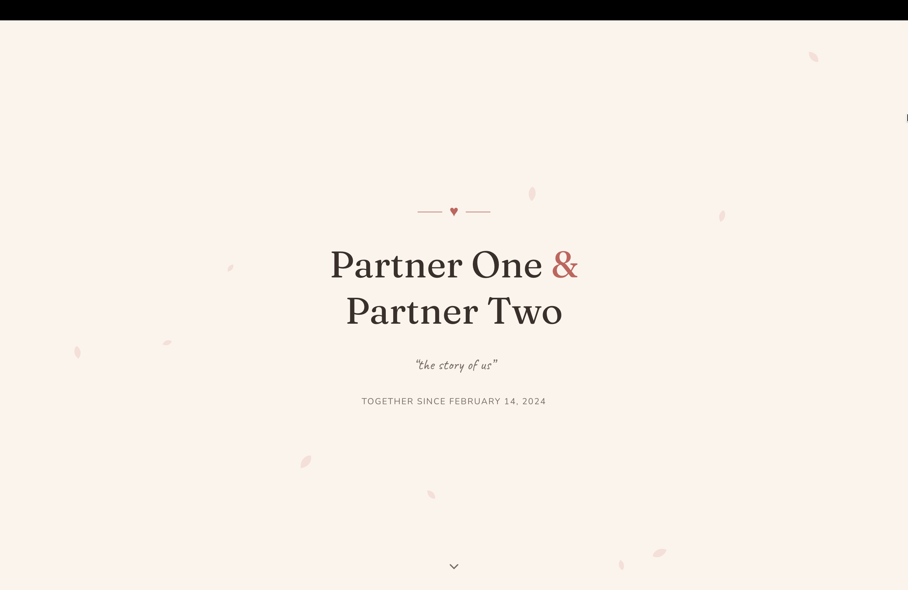
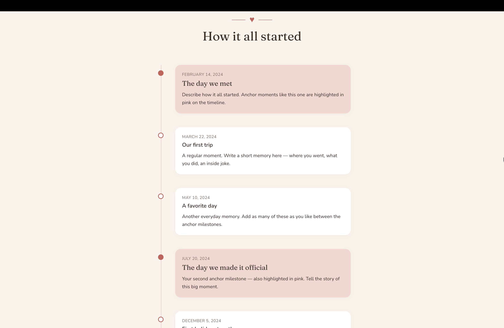
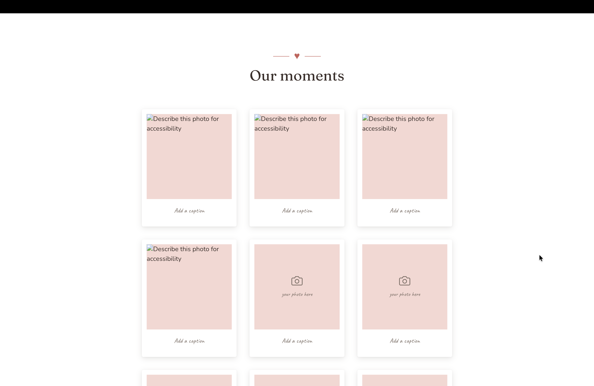
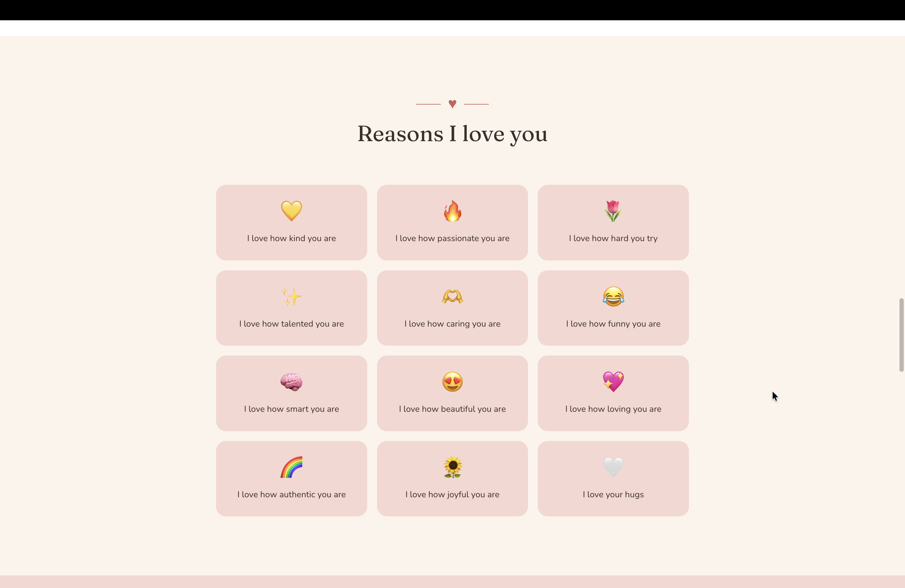
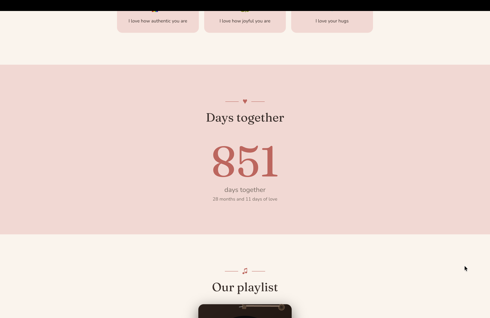
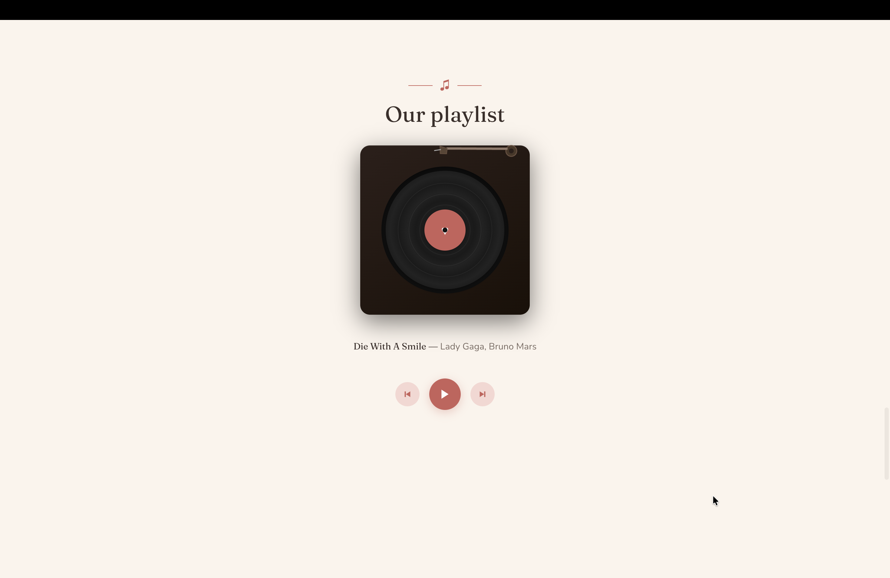
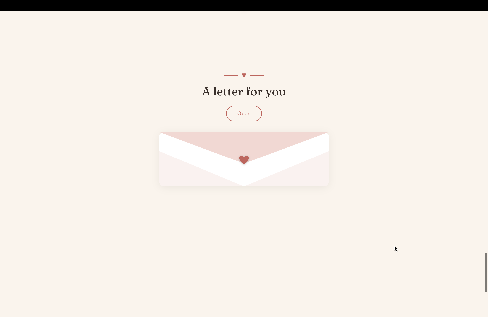
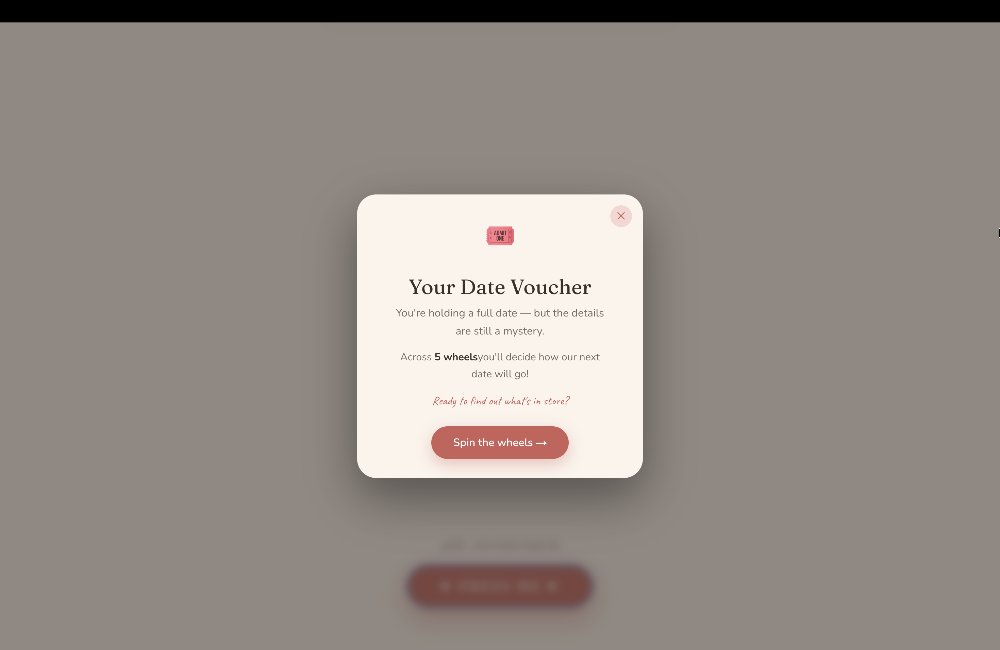
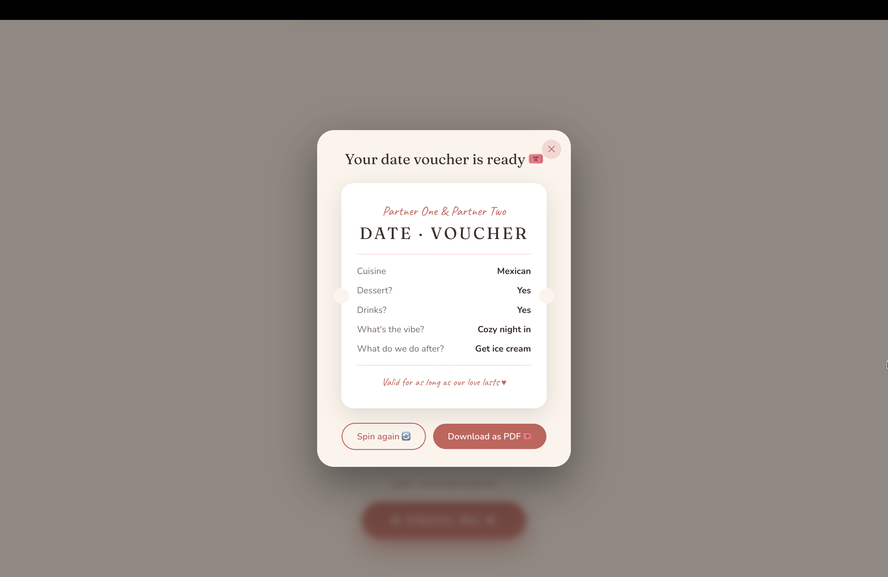

# 玉米饼和 77 的日子

一个独立的情侣纪念网站，记录从 2026 年 5 月 8 日开始的日子。

线上地址将在 GitHub Pages 部署后提供：

```text
https://soyo19740-coder.github.io/love-days/
```

## 内容维护

- 双方名字、时间线、喜欢的理由、情书和歌曲配置：`content/content.ts`
- 照片：`public/photos/`
- GitHub Pages 工作流：`.github/workflows/deploy.yml`

照片加入后，在 `content/content.ts` 的 `photos` 列表中填写对应路径，例如：

```ts
{ src: "/photos/01.jpg", alt: "第一次约会", caption: "2026 年 8 月 9 日" }
```

Spotify 请提供完整歌曲链接（以及对应歌手）；收到后可将曲目 ID 填入配置。目前页面只展示 `Stay With Me`，播放控件会保持禁用，不会错误播放其他歌曲。

## 原模板

本项目基于 [love-site-template](https://github.com/maguila-gus25/love-site-template) 二次开发，保留原项目的 MIT LICENSE。

---

# The Story of Us — a romantic gift website

A single-page, mobile-first "love letter as a website": an animated, scrollable
keepsake you can personalize and give to someone special. Built as a portfolio
piece and shipped as a reusable, content-driven template — **edit one file and
the whole site updates.**

🔗 **Live demo:** **[love-site-template.vercel.app](https://love-site-template.vercel.app)**

> The demo uses placeholder content (`Partner One & Partner Two`). Drop in your
> own names, dates, photos, playlist and letter to make it yours.

---

## Preview

<!--
  HOW TO ADD YOUR SCREENSHOTS:
  1. Save each screenshot in the docs/screenshots/ folder.
  2. Use exactly the filenames referenced below (e.g. 01-hero.png) so the images
     show up automatically — or rename both the file and the link to match.
  3. PNG or JPG both work. A width of ~1000px looks good on GitHub.
  4. Commit and push: git add docs/screenshots && git commit -m "docs: add screenshots" && git push
-->

| | |
|---|---|
| **Hero** — opening section with falling petals | **Timeline** — how it all started |
|  |  |
| **Gallery** — polaroid grid | **Reasons I love you** — card grid |
|  |  |
| **Days together** — live counter | **Vinyl** — turntable + Spotify player |
|  |  |
| **Letter** — animated envelope | **Date voucher** — spin-the-wheel |
|  |  |
| **Date voucher** — final ticket (PDF) | |
|  | |

> Replace each `docs/screenshots/...` image above with your own screenshots —
> see the comment in this section's source for the exact filenames.

---

## What it demonstrates

- **Next.js 16 (App Router)** with **React 19** and **TypeScript** end to end.
- **Rich, hand-built animations with [Motion](https://motion.dev)** — no UI kit:
  - Falling petals and staggered reveals on the hero.
  - A timeline and a gallery with a **shared-layout lightbox** (`layoutId`).
  - An **animated envelope** that opens in layers (seal → flap → letter slides out).
  - A **vinyl turntable** wired to the **Spotify iFrame API** — the disc spins and
    the tonearm tracks the current song, with play/prev/next controls.
  - A sequence of **spin-the-wheel** roulettes with easing-based deceleration that
    build a "date voucher" you can **export to PDF** on the fly.
- **Content-driven architecture** — every string, date, photo, song and the letter
  live in a single typed module (`content/content.ts`); components never hardcode copy.
- **Accessibility & polish** — semantic landmarks, `aria-label`s, keyboard `Esc`
  handling for overlays, and `prefers-reduced-motion` support.
- **On-demand code splitting** — `html2canvas` and `jspdf` are dynamically imported
  only when the PDF is generated, keeping the initial bundle lean.

## Tech stack

| Layer | Technology |
|---|---|
| Framework | Next.js 16.2.7 (App Router) |
| UI | React 19 + TypeScript |
| Styling | Tailwind CSS 4 (CSS design tokens) |
| Animation | Motion v12 |
| PDF export | html2canvas + jsPDF (lazy-loaded) |
| Fonts | Fraunces, Caveat, Nunito (`next/font`) |
| Deploy | Vercel |

## Sections

`Hero` · `Timeline` · `Gallery` (lightbox) · `Reasons I love you` · `Days together`
counter · `Vinyl` player · animated `Letter` · `Date voucher` (spin wheels + PDF).

## Use it as a template

Everything you'd want to change lives in **`content/content.ts`**:

1. Set the couple names, start date and proposal date.
2. Fill in the timeline `moments` (mark the big ones with `anchor: true` — they're
   highlighted in pink).
3. Add your reasons in `thingsILove` and your songs in `vinylPlaylist`
   (Spotify track URIs).
4. Customize the `dateVoucherSteps` and write your `LETTER`.
5. Drop images into **`public/photos/`** (`01.jpg`, `02.jpg`, …) — until you do,
   the gallery shows a friendly "your photo here" placeholder, so the layout never
   breaks.

## Run locally

```bash
npm install
npm run dev        # http://localhost:3000
```

Other commands:

```bash
npm run build      # production build
npm run start      # serve the production build
npm run lint       # ESLint
npx tsc --noEmit   # type-check
```

## Deploy

Deploys to [Vercel](https://vercel.com) with zero configuration — import the repo
(or run `vercel`) and it builds out of the box. No environment variables required.

## Project structure

```
.
├── app/
│   ├── globals.css       # design tokens (colors + fonts) and base styles
│   ├── layout.tsx        # root layout, fonts, metadata
│   └── page.tsx          # composes all sections in order
├── components/
│   ├── Hero.tsx          # opening section
│   ├── HeroPetals.tsx    # animated falling petals
│   ├── Counter.tsx       # days-together counter
│   ├── Timeline.tsx      # milestones timeline
│   ├── Gallery.tsx       # polaroid gallery with lightbox
│   ├── ThingsILove.tsx   # "reasons I love you" grid
│   ├── Vinyl.tsx         # turntable + Spotify iFrame API
│   ├── Letter.tsx        # animated envelope + letter
│   └── DateVoucher.tsx   # spin-the-wheel + PDF export
└── content/
    └── content.ts        # ALL editable content (names, dates, text, photos)
```

## License

MIT — free to use, fork and personalize.
